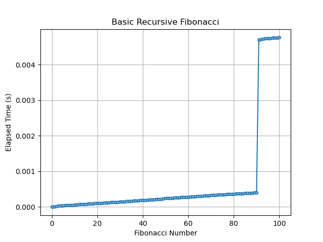

<h1 style="line-height: 90%;">Topics in CS: Assignment 1 </h1>
<h3 style="line-height: 10%;"> Spring 2025 </h3>
 
<h1 style="line-height: 100%;"> Program List </h1>
<h6 style="line-height: 100%;"> Both of these programs were created with love and care, listed below as links for your ease of use. </h6>

## [Echo](echo.py) </h2>
## [Fib](fib.py)

 

[<h1 style="line-height: 100%;"> Echo.py </h1>](echo.py)
<h4 style="line-height: 100%;">If there was a lot to write about this program, I would. But it has one job, and that's to imitate an echo like you're on a mountain.</h4>

<h4 style="line-height: 100%;">The code is simple, and the output is even simpler. It takes in a string, and prints it back out with an echo. </h4>

[<h1 style="line-height: 100%;"> Fib.py </h1>](fib.py)
<h4 style="line-height: 100%;">The Fibonacci Sequence is not a difficult sequence to figure out by any means, which makes it relatively easy to program. As humans, we can very quickly figure out the first few numbers, but just as quickly begin to make mistakes and realize that our efforts may be spent better somewhere else.</h4>
<h4 style="line-height: 100%;">The task here was simple, but I chose to make it not. Because there's something very interesting about the results of the assignment. The algorithm here is trivial recursion, and aided by a timer wrapper.</h4>

<h4 style="line-height: 100%;">The output is also simple, but the results are very interesting. The first few numbers are very quick to calculate, but as the numbers get larger, the time it takes to calculate them would increase exponentially. That is, unless you make use of a LRU *(Least Recently Used)* cache, which saves a set configurable amount of previously computed data, and saves the computer from having to start right back at square 1 and work its way back up.</h4>
<h2 style="line-height: 100%;">Figure 1:</h3>

<h6 style="line-height: 100%;">The results are as predicted, with the time to compute each further number raising partially linearly.</h4>

### **But *wait.*** Why is there a large jump in computation time?
### **The answer? Really big numbers. Really, really big numbers.**

<h4 style="line-height: 100%;">Natively, Python can work with really large numbers, but the problem here happens when the algorithm has to calculate Fibonacci numbers greater than the maximum value of a 64 bit signed integer. </h4>

* <h5 style="line-height: 100%;">90th Fibonacci number: 2,880,067,194,370,816,120</h5>
* <h5 style="line-height: 100%;">91st Fibonacci number: 4,679,946,161,537,630,720</h5>
* <h5 style="line-height: 100%;">92nd Fibonacci number: 7,540,113,804,746,346,429</h5>
* *<h4 style="line-height: 100%;">64 bit int max value: 9,223,372,036,854,775,807</h4>*

<h4 style="line-height: 100%;">You can tell what's going to happen, and so does Python, which is why it switches to higher capacity data methods, leading to an increase in computing time. And from there, we carry on until we eventually reach the maximum recursion depth errors. </h4>

### **Though I was not done, and felt unsatisfied. *Surely*, there's a way to compute bigger numbers**</h3>
### **Enter *Matrix Multiplication*, the mathmatecally backed method of "1, 2, skip a few, 100"**</h3>

<h3 style="line-height: 100%;">By using Numpy and matrices, we can not only calculate bigger numbers, but we can do it *faster.* Let's take a look at just how fast.</h3>
<h2 style="line-height: 100%;">Figure 2:</h2>

<h6 style="line-height: 100%;">Lower numbers mean faster, which is better.</h4>
<h3 style="line-height: 100%;">By keeping numbers *relatively* "small", we can keep Python from having to use bigger data types, and keeping computation time low. Pretty cool right?</h3>